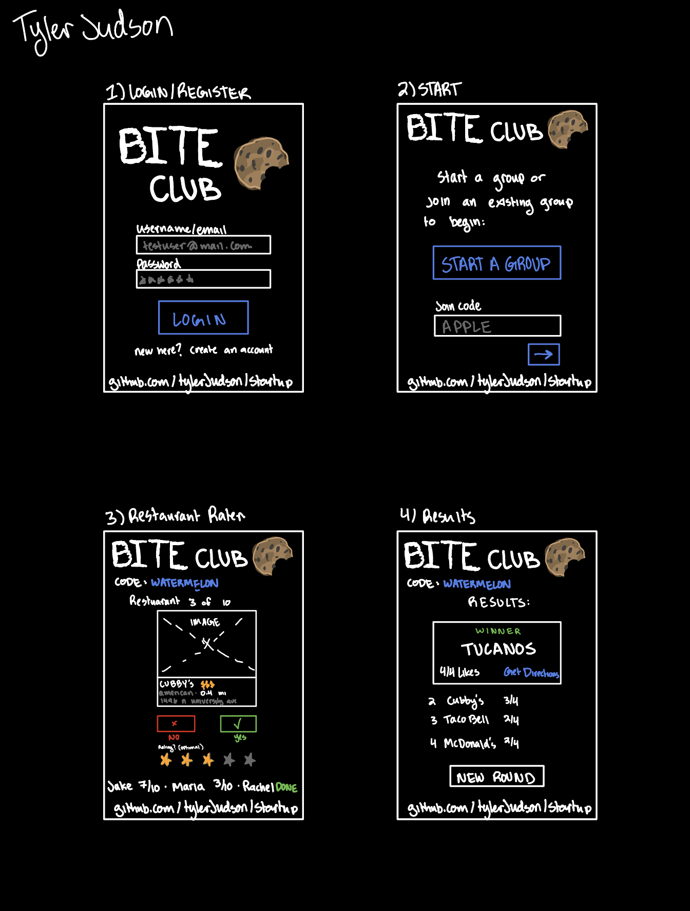

# Bite Club

The first rule of Bite Club: everybody eats.

## Elevator pitch

The amount of times that someone has asked "where should we eat?" and then nobody
answers is too many to count. Somebody throws out a place, somebody else already
went there Tuesday, and 2 people say they are fine with anything and they are not
fine with anything. 20 minutes later we are all still standing in a parking lot.
Bite Club fixes that. One person starts a group and gets a code, everyone joins
on their phone, and the same restaurants show up for all of them. You tap
through them yes or no and you can watch how far along your friends are.
When the last person finishes, every screen jumps to the results at the same
time and the place with the most yeses wins.

## Key features

- Account signup and login over HTTPS
- Start a group and get a join code 
- Friends join with the code and get the exact same restaurant list
- 10 nearby restaurants pulled from live map data using the group's location
- Voting is private so nobody gets influenced by anybody else
- You can see how far along everyone else is while you vote
- Every screen goes to the results on its own when the last person finishes
- Ranked results with the winner, the vote count for each place, and a link to
  directions
- Groups and votes get saved so you can go back to a group

## Future features

These are ideas for after the main thing works—they are not part of the plan
right now.

- A star rating on top of the yes or no
- Filters for price, distance, or dietary stuff
- Group history stats

## Technologies

I am going to use the required technologies like this:

- **HTML** - 4 views, each one built with real structural HTML: login and
  register, start or join a group, the rater, and the results. Every page uses
  `header` for the nav, `main` for the content, and `footer` with a link to this
  github repo. There are placeholders for the third party restaurant data, the
  results that come out of the database, the login form, and the friend progress.

- **CSS** - Dark theme with one blue accent color for every primary action.
  Flexbox for the layout so the rater works on a phone held in one hand, because
  that is the only way anyone is going to use this. Bootstrap for the basic
  components, an imported font for the headings, and an animation of the card
  leaving the screen when you vote on it.

- **React** - Single page app. Components for the login form, the group start
  screen, the restaurant card, the vote buttons, the friend progress list, and
  the results list. React Router moves between the 4 views based on where you are
  in the flow. `useState` holds the card stack, the current index, and the votes
  so far. `useEffect` does the first restaurant fetch and opens and closes the
  WebSocket.

- **Service** - Node.js and Express on the backend. It serves the frontend with
  static middleware and has these endpoints:
  - `POST /api/auth/create` - make a new user
  - `POST /api/auth/login` - log in and get an auth cookie
  - `DELETE /api/auth/logout` - log out
  - `POST /api/group` - make a group, gives back the join code
  - `POST /api/group/:code/join` - join a group that already exists
  - `GET /api/group/:code/restaurants` - the group's restaurant list
  - `POST /api/group/:code/vote` - send a yes or no for one restaurant
  - `GET /api/group/:code/results` - the counted up results
  - Third party service: the [Overpass API](https://overpass-api.de/) for
    OpenStreetMap data. The backend asks for `amenity=restaurant` inside a radius
    of the group's coordinates and gets back the name, cuisine, address, and
    position, and I calculate the distance from that. Overpass does not need an
    API key, it supports CORS, and it is served over HTTPS.

- **Database** - MongoDB holds the user accounts with BCrypt hashed passwords,
  the auth tokens, each group with its join code and the restaurant list it was
  made with, and every vote anybody casts. The results screen is just vote data
  read back out of the database. You have to be logged in to vote.

- **WebSocket** - As each person votes, how far they are through the stack gets
  sent to everyone else in the group, so the rater screen shows where everybody
  is in realtime. When the last person finishes, the server pushes a done event
  and every client moves to the results at the same time.

## Specification Deliverable

For this deliverable I did the following.

- [x] **Prerequisites** - Created a public startup repository with an MIT license and
      committed my README and design image to it.
- [x] **Proper use of Markdown** - Used headers, nested bullet lists, bold, inline code
      for my endpoints, links, an embedded image, and a task list.
- [x] **Elevator pitch** - One paragraph on the parking-lot problem and how a shared
      join code plus private voting solves it.
- [x] **Key features** - Nine features covering login, group join codes, the shared
      restaurant list, private voting, live friend progress, automatic advance to
      results, and ranked results. Stretch ideas are listed separately under Future
      features.
- [x] **How I will use each technology** - A paragraph each for HTML, CSS, React,
      Service, Database, and WebSocket, including my eight backend endpoints and the
      Overpass API I will call for nearby restaurants.
- [x] **Rough sketches** - Embedded Sketches.png, four hand-drawn wireframes for the
      login/register, start-or-join, rater, and results views.
